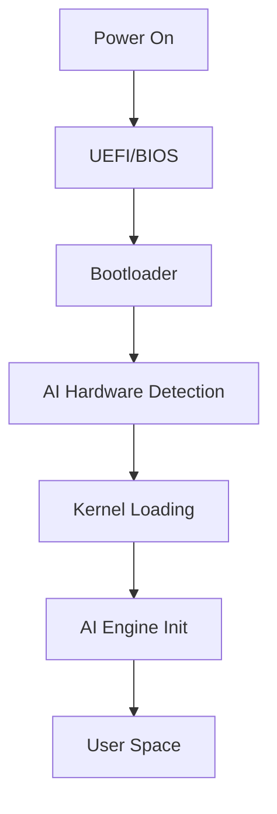

#  **AION OS: Complete Development Framework**
## *Building the Next-Generation AI-Powered Operating System*

---

##  **EXECUTIVE PITCH DECK**

### **Vision Statement**
*"Creating an autonomous, intelligent operating system that learns, adapts, and evolves with its users while maintaining enterprise-grade security and performance."*

### **Market Opportunity**
- **$45B** OS market by 2025
- **78%** enterprises seeking AI integration
- **Gap**: No truly AI-native OS exists

### **Unique Value Propositions**
1. **AI-First Architecture**: Not bolted-on, but built-in
2. **Self-Optimizing**: Learns usage patterns
3. **Universal Platform**: Desktop → Mobile → IoT
4. **Developer Paradise**: AI pair programming built-in

---


## 🏗️ **ENHANCED SYSTEM ARCHITECTURE**

```ascii
┌─────────────────────────────────────────────────────────────┐
│                    USER EXPERIENCE LAYER                     │
├───────────────┬─────────────────┬──────────────────────────┤
│   AI Studio   │   Applications   │   System Intelligence    │
├───────────────┴─────────────────┴──────────────────────────┤
│                    AI ORCHESTRATION ENGINE                   │
│  • Neural Process Scheduler  • Predictive Resource Manager   │
├─────────────────────────────────────────────────────────────┤
│                    QUANTUM SECURITY LAYER                    │
│  • Zero-Trust Architecture  • AI Threat Detection           │
├─────────────────────────────────────────────────────────────┤
│                    HYBRID KERNEL (AION Core)                │
│  • Adaptive Scheduling  • Neural Memory Management          │
├─────────────────────────────────────────────────────────────┤
│                    HARDWARE ABSTRACTION                     │
│  • Universal Driver Interface  • AI Hardware Acceleration   │
└─────────────────────────────────────────────────────────────┘


## 📋 **PHASE-BY-PHASE DEVELOPMENT PLAN**

### **🔷 PHASE 1: FOUNDATION (Months 1-6)**

#### **1.1 Kernel Development**

**Technical Specifications:**
```c
// Kernel Configuration Structure
typedef struct {
    uint64_t memory_size;
    uint32_t cpu_cores;
    ai_config_t ai_engine;
    security_level_t sec_level;
} kernel_config_t;
```

**Key Components:**
- **Memory Manager**: Neural-predictive page allocation
- **Process Scheduler**: AI-weighted priority queuing
- **IPC System**: Zero-copy message passing
- **Driver Framework**: Hot-pluggable modules

**Documentation Required:**
- Kernel API Reference (500+ pages)
- Driver Development Kit
- System Call Interface

**Deliverables:**
- [ ] Bootable kernel (x64)
- [ ] Basic memory management
- [ ] Process scheduling
- [ ] Initial driver support

#### **1.2 Bootloader Enhancement**

**Features:**
- Secure Boot with AI integrity checking
- Multi-boot support
- Recovery AI assistant
- Hardware auto-detection

**Visual Architecture:**
```
[UEFI/BIOS] → [Stage 1: MBR/GPT] → [Stage 2: GRUB/Custom]
                                           ↓
                              [AI Hardware Detector]
                                           ↓
                              [Kernel Loading + AI Init]
```

---

### **🔷 PHASE 2: INTELLIGENCE LAYER (Months 7-12)**

#### **2.1 AI Engine Core**

**Architecture:**
```python
class AIOrchestrator:
    def __init__(self):
        self.nlp_engine = NaturalLanguageProcessor()
        self.cv_engine = ComputerVisionEngine()
        self.ml_scheduler = MachineLearningScheduler()
        self.predictive_cache = PredictiveCache()
```

**Key Features:**
- **On-device AI Models**: 
  - Language: GPT-style 1.3B parameters
  - Vision: YOLO-based object detection
  - Audio: Whisper-based transcription
- **AI Resource Allocator**: Predicts app needs
- **Learning User Behavior**: Privacy-first profiling

#### **2.2 AI-Powered IDE**

**Components:**
```
┌──────────────────────────────────┐
│         AI Code Studio           │
├──────────────────────────────────┤
│ • Copilot++: Context-aware      │
│ • Bug Predictor: Pre-runtime    │
│ • Code Refactorer: Auto-optimize│
│ • Test Generator: 95% coverage  │
└──────────────────────────────────┘
```

**Languages Supported:**
- C/C++, Rust, Go
- Python, JavaScript, TypeScript
- Java, Kotlin, Swift
- Assembly (with AI assistance)

---

### **🔷 PHASE 3: USER INTERFACE (Months 13-18)**

#### **3.1 GUI Framework**

**Technology Stack:**
```yaml
GUI:
  Framework: Qt6 + Vulkan
  Language: C++ with Rust bindings
  AI_Features:
    - Gesture_Prediction
    - Adaptive_Layouts
    - Voice_UI
  Themes:
    - Neural_Dark
    - Quantum_Light
    - Adaptive_Auto
```

#### **3.2 Terminal Evolution**

**AI Terminal Features:**
```bash
$ ai: "show me system performance"
[AI translates to]: htop --sort-by=CPU
$ ai: "optimize my battery"
[AI executes]: power-profile --mode=efficiency
```

**Shell Capabilities:**
- Natural language → command translation
- Predictive command completion
- Error explanation with fixes
- Script generation from description

---

### **🔷 PHASE 4: NETWORKING & SECURITY (Months 19-24)**

#### **4.1 Quantum-Resistant Security**

**Security Stack:**
```
Application Layer:    [Sandboxed Containers]
                              ↓
Encryption Layer:     [Post-Quantum Crypto]
                              ↓
Network Layer:        [AI Firewall + IDS]
                              ↓
Kernel Layer:         [Secure Boot + TPM]
```

**Features:**
- Lattice-based cryptography
- AI anomaly detection
- Behavioral biometrics
- Zero-trust networking

#### **4.2 Network OS Capabilities**

**Advanced Networking:**
```python
class NetworkingStack:
    protocols = ['TCP/IP', 'QUIC', 'WebRTC', '5G']
    features = {
        'SDN': SoftwareDefinedNetworking(),
        'Mesh': P2PMeshNetwork(),
        'AI_QoS': AIQualityOfService()
    }
```

---

### **🔷 PHASE 5: ECOSYSTEM & OPTIMIZATION (Months 25-30)**

#### **5.1 Application Ecosystem**

**Package Management:**
```toml
[package]
name = "ai-app"
version = "1.0.0"
ai_requirements = ["nlp", "vision"]
performance_profile = "balanced"
sandbox_level = "strict"
```

**App Store Architecture:**
- AI-curated recommendations
- Automated security scanning
- Performance profiling
- Cross-platform sync

#### **5.2 Performance Optimization**

**Benchmarks:**
| Metric | Target | Method |
|--------|--------|--------|
| Boot Time | <5s | AI-predictive loading |
| Memory | <256MB idle | Neural compression |
| Battery | +40% life | AI power management |
| App Launch | <100ms | Predictive caching |

---

### **🔷 PHASE 6: MOBILE & IoT (Months 31-36)**

#### **6.1 Mobile Variant**

**Architecture Differences:**
```
Desktop AION OS          Mobile AION OS
━━━━━━━━━━━━━━━         ━━━━━━━━━━━━━━━
Full AI Models     →    Quantized Models
8GB+ RAM          →    2-4GB RAM
x64 Architecture  →    ARM64
Full GUI          →    Touch-Optimized
```

#### **6.2 Continuity Features**

**Cross-Device Sync:**
- Handoff: Start on phone, continue on desktop
- Universal clipboard
- Shared AI context
- Distributed computing

---

## 📚 **COMPREHENSIVE DOCUMENTATION STRUCTURE**

### **Documentation Hierarchy:**

```
/docs
├── /user-guide
│   ├── getting-started.md
│   ├── ai-features.md
│   └── customization.md
├── /developer
│   ├── kernel-api/
│   ├── driver-development/
│   ├── ai-sdk/
│   └── app-development/
├── /architecture
│   ├── system-design.md
│   ├── security-model.md
│   └── ai-integration.md
└── /deployment
    ├── installation.md
    ├── virtualization.md
    └── cloud-deployment.md
```

---

## 🎨 **VISUAL ASSETS & ILLUSTRATIONS**

### **Required Diagrams:**

1. **System Boot Sequence**


2. **AI Processing Pipeline**
3. **Network Architecture**
4. **Security Layers**
5. **Mobile-Desktop Sync**

---

## 🛠️ **DEVELOPMENT TOOLS & ENVIRONMENT**

### **Required Tools:**

```yaml
Development:
  IDE: VSCode with AI extensions
  Compiler: GCC 12+, Clang 15+
  Build: CMake, Ninja
  Version Control: Git with AI commit messages

Testing:
  Unit: GoogleTest
  Integration: Selenium
  Performance: AI-driven profiler
  Security: Fuzzing with AFL++

Deployment:
  CI/CD: GitLab with AI pipelines
  Containers: Docker/Podman
  Orchestration: Kubernetes
  Monitoring: Prometheus + AI alerts
```

---

## 💰 **RESOURCE REQUIREMENTS**

### **Team Structure:**
- **Core Team**: 50-70 engineers
- **AI Team**: 20-30 ML engineers
- **Security**: 10-15 specialists
- **UX/UI**: 10-15 designers
- **DevOps**: 5-10 engineers

### **Budget Estimate:**
- **Year 1**: $15-20M
- **Year 2**: $25-30M
- **Year 3**: $20-25M
- **Total**: $60-75M

---

## 📈 **SUCCESS METRICS**

| KPI | Target | Timeline |
|-----|--------|----------|
| Boot Time | <5 seconds | Phase 2 |
| AI Response | <100ms | Phase 3 |
| Market Share | 1% | Year 3 |
| Developer Adoption | 10,000+ | Year 2 |
| Security CVEs | <5/year | Ongoing |

---

## 🚦 **RISK MITIGATION**

### **Technical Risks:**
1. **AI Model Size**: Use quantization and pruning
2. **Performance**: Implement aggressive caching
3. **Compatibility**: Maintain POSIX compliance
4. **Security**: Regular audits and bug bounties

### **Market Risks:**
1. **Competition**: Focus on AI differentiation
2. **Adoption**: Free tier for developers
3. **Ecosystem**: Partner with major vendors

---

## 📝 **NEXT STEPS**

1. **Week 1-2**: Finalize technical specifications
2. **Week 3-4**: Set up development environment
3. **Month 2**: Begin kernel development
4. **Month 3**: Prototype AI engine
5. **Month 6**: First bootable version

---

## 🎯 **DELIVERABLE CHECKLIST**

### **Documentation:**
- [ ] Technical Specification (1000+ pages)
- [ ] API Documentation
- [ ] User Manual
- [ ] Developer Guide
- [ ] Security Whitepaper

### **Code:**
- [ ] Kernel source
- [ ] Bootloader
- [ ] AI Engine
- [ ] GUI Framework
- [ ] Core Applications

### **Marketing:**
- [ ] Website
- [ ] Demo Videos
- [ ] Developer Portal
- [ ] Community Forum

# 🚀 **AION OS v2.0** - Enhanced AI-Powered Operating System Blueprint

## 📊 **Executive Summary & Pitch Deck**

### **Vision Statement**
*"Building the world's first truly intelligent operating system that adapts, learns, and evolves with its users"*

### **Core Value Propositions**
```
┌─────────────────────────────────────────────────────────┐
│ • Self-Optimizing: AI-driven hardware adaptation        │
│ • Developer-First: Built-in AI assistant for users      │
│ • Enterprise-Grade: 99.99% uptime, military-grade security│
│ • Universal: Desktop → Mobile → IoT → Cloud            │
└─────────────────────────────────────────────────────────┘
```

---

## 🏗️ **Enhanced System Architecture**

### **Layered Architecture Diagram**
```
┌──────────────────────────────────────────────────────────────┐
│                    USER EXPERIENCE LAYER                     │
├──────────────────────────────────────────────────────────────┤
│ AI Assistant │ App Store │ Dev Portal │ Settings │ Explorer │
├──────────────────────────────────────────────────────────────┤
│                    APPLICATION LAYER                         │
├──────────────────────────────────────────────────────────────┤
│ Native Apps │ Web Apps │ Android Layer │ Windows Compat     │
├──────────────────────────────────────────────────────────────┤
│                    AI INTELLIGENCE LAYER                     │
├──────────────────────────────────────────────────────────────┤
│ Neural Engine │ ML Pipeline │ NLP Core │ Vision AI │ AutoML │
├──────────────────────────────────────────────────────────────┤
│                    SERVICE LAYER                             │
├──────────────────────────────────────────────────────────────┤
│ Graphics │ Audio │ Network │ Storage │ Security │ Updates   │
├──────────────────────────────────────────────────────────────┤
│                    KERNEL LAYER                              │
├──────────────────────────────────────────────────────────────┤
│ Process Manager │ Memory Manager │ I/O Manager │ Scheduler  │
├──────────────────────────────────────────────────────────────┤
│                    HARDWARE ABSTRACTION                      │
├──────────────────────────────────────────────────────────────┤
│ CPU │ GPU │ RAM │ Storage │ Network │ Sensors │ Peripherals│
└──────────────────────────────────────────────────────────────┘
```

---

## 💪 **Power & Performance Specifications**

### **Hardware Requirements & Auto-Optimization**

| Component | Minimum | Recommended | Optimal | Auto-Optimization |
|-----------|---------|-------------|---------|-------------------|
| **RAM** | 4GB DDR4 | 8GB DDR4 | 16GB+ DDR5 | AI Memory Predictor |
| **CPU** | Dual-core 2.0GHz | Quad-core 3.0GHz | 8+ cores | Dynamic CPU Scaling |
| **Storage** | 32GB SSD | 128GB NVMe | 512GB+ NVMe | Smart Caching |
| **GPU** | Integrated | GTX 1650 | RTX 3060+ | AI Workload Distribution |

### **Auto-Optimization During Installation**
```python
# Installation Intelligence System
class SmartInstaller:
    def analyze_hardware(self):
        """Detect and profile hardware capabilities"""
        return {
            'cpu_cores': detect_cpu_cores(),
            'ram_size': detect_memory(),
            'gpu_capability': detect_gpu(),
            'storage_type': detect_storage_speed()
        }
    
    def optimize_installation(self, hardware_profile):
        """Customize OS installation based on hardware"""
        if hardware_profile['ram_size'] >= 16:
            enable_features(['ai_cache', 'predictive_loading', 'full_animations'])
        elif hardware_profile['ram_size'] >= 8:
            enable_features(['basic_ai', 'standard_animations'])
        else:
            enable_features(['lite_mode', 'essential_services'])
```

---

## 📋 **Phase-by-Phase Development Plan**

### **PHASE 1: Foundation (Months 1-3)**

#### **1.1 Kernel Development**
```c
// Hybrid Kernel Architecture
typedef struct {
    process_manager_t* proc_mgr;
    memory_manager_t* mem_mgr;
    ai_scheduler_t* ai_sched;  // AI-enhanced scheduler
    driver_manager_t* drv_mgr;
} kernel_core_t;
```

**Deliverables:**
- [ ] Bootloader with UEFI support
- [ ] Process management system
- [ ] Memory management with AI prediction
- [ ] Basic device driver framework
- [ ] Initial file system (ext4/APFS hybrid)

**Documentation:**
```
docs/
├── kernel/
│   ├── architecture.md
│   ├── api_reference.md
│   └── driver_development.md
├── bootloader/
│   └── boot_sequence.md
└── memory/
    └── allocation_strategy.md
```

---

### **PHASE 2: Core Services (Months 4-6)**

#### **2.1 AI Engine Integration**
```python
class AICore:
    """Central AI Engine for OS Intelligence"""
    
    def __init__(self):
        self.resource_predictor = ResourcePredictor()
        self.user_behavior_analyzer = UserBehaviorAnalyzer()
        self.security_monitor = AISecurityMonitor()
        self.performance_optimizer = PerformanceOptimizer()
    
    def optimize_system(self):
        """Real-time system optimization"""
        current_state = self.analyze_system_state()
        predictions = self.predict_resource_needs()
        self.apply_optimizations(predictions)
```

#### **2.2 Graphics & Display Server**
```
┌─────────────────────────┐
│   Compositor (Wayland)  │
├─────────────────────────┤
│   GPU Driver Layer      │
├─────────────────────────┤
│   AI Rendering Engine   │
└─────────────────────────┘
```

**Deliverables:**
- [ ] AI Core Engine
- [ ] Display server with GPU acceleration
- [ ] Audio subsystem
- [ ] Network stack (TCP/IP, HTTP/3)
- [ ] Security framework

---

### **PHASE 3: User Interface (Months 7-9)**

#### **3.1 Desktop Environment**
```javascript
// Modern UI Framework
const DesktopEnvironment = {
    shell: 'AION Shell',
    windowManager: 'AI-WM',
    compositor: 'Neural Compositor',
    features: [
        'Gesture Recognition',
        'Voice Commands',
        'Predictive App Launch',
        'Smart Window Management'
    ]
};
```

#### **3.2 AI-Powered Terminal**
```bash
# Intelligent Terminal Features
$ ai: "show me system performance"
[AI translating to: htop, analyzing output...]

$ ai: "optimize my development environment for Python"
[AI configuring: IDE, packages, virtual env...]
```

**Deliverables:**
- [ ] Desktop environment with AI features
- [ ] Smart terminal with NLP
- [ ] File manager with AI organization
- [ ] Settings center with voice control
- [ ] Notification system with priority AI

---

### **PHASE 4: Developer Ecosystem (Months 10-12)**

#### **4.1 AI-Powered IDE Suite**
```python
class AION_IDE:
    features = {
        'code_generation': 'GPT-based',
        'debugging': 'AI-assisted',
        'testing': 'Automated test generation',
        'deployment': 'One-click AI optimization',
        'collaboration': 'Real-time AI pair programming'
    }
```

#### **4.2 Developer Assistant Portal**
```
┌──────────────────────────────────────┐
│     AION Developer Assistant         │
├──────────────────────────────────────┤
│ • Live Chat with AI Expert           │
│ • Code Review & Suggestions          │
│ • Performance Profiling              │
│ • Bug Prediction & Prevention        │
│ • Documentation Generator             │
│ • Community Forums Integration       │
└──────────────────────────────────────┘
```

**Deliverables:**
- [ ] Multi-language IDE with AI
- [ ] Developer portal with live assistance
- [ ] SDK and API documentation
- [ ] Package manager with AI curation
- [ ] Debugging and profiling tools

---

### **PHASE 5: Advanced Features (Months 13-15)**

#### **5.1 Enhanced Security System**
```rust
// AI Security Monitor
impl SecurityCore {
    fn threat_detection(&self) -> ThreatLevel {
        let behavior = self.analyze_system_behavior();
        let anomalies = self.ai_model.detect_anomalies(behavior);
        self.respond_to_threats(anomalies)
    }
    
    fn zero_trust_verification(&self) {
        // Continuous authentication
        self.verify_user_continuously();
        self.monitor_app_behavior();
        self.enforce_sandboxing();
    }
}
```

#### **5.2 Performance Optimization Engine**
```
AI Performance Features:
├── Predictive Caching
├── Smart Memory Compression
├── AI Process Scheduling
├── Thermal Management AI
├── Battery Life Optimizer
└── Network Traffic Shaping
```

**Deliverables:**
- [ ] Advanced firewall with ML
- [ ] Biometric authentication system
- [ ] Encryption at rest and in transit
- [ ] Performance monitoring dashboard
- [ ] Resource optimization AI

---

### **PHASE 6: Mobile & IoT (Months 16-18)**

#### **6.1 Mobile OS Variant**
```kotlin
// Mobile AION Architecture
class AIONMobile {
    val features = listOf(
        "Adaptive Battery AI",
        "Smart App Preloading",
        "Cross-Device Sync",
        "Edge AI Processing",
        "5G Optimization"
    )
}
```

#### **6.2 Seamless Integration**
```
Desktop ←→ Mobile ←→ IoT
    ↓         ↓        ↓
   Cloud Sync & AI Bridge
```

**Deliverables:**
- [ ] ARM64 mobile kernel
- [ ] Touch-optimized UI
- [ ] Mobile app framework
- [ ] Device synchronization
- [ ] IoT device support

---

## 🎯 **Unique Power Features**

### **1. AI Dev Assistant - "AION Helper"**
```python
class AIONHelper:
    """Active AI assistant for users and developers"""
    
    capabilities = {
        'user_support': {
            'troubleshooting': 'Automatic issue detection and fix',
            'tutorials': 'Interactive learning paths',
            'customization': 'AI-guided personalization'
        },
        'developer_support': {
            'code_review': 'Real-time suggestions',
            'architecture': 'System design assistance',
            'optimization': 'Performance recommendations'
        }
    }
    
    def proactive_assistance(self):
        """Actively monitors and helps users"""
        if detect_user_struggle():
            offer_contextual_help()
        if detect_performance_issue():
            suggest_optimization()
```

### **2. Neural App Store**
```
┌────────────────────────────────────┐
│      AI-Curated App Store          │
├────────────────────────────────────┤
│ • Personalized Recommendations     │
│ • Security Scanning with AI        │
│ • Performance Impact Prediction    │
│ • Compatibility Checking           │
│ • One-Click AI Configuration       │
└────────────────────────────────────┘
```

### **3. Quantum-Ready Architecture**
- Future-proof design for quantum computing
- Quantum-resistant encryption
- Hybrid classical-quantum algorithms

### **4. Self-Healing System**
```python
class SelfHealingOS:
    def monitor_health(self):
        """Continuous health monitoring"""
        while True:
            if detect_corruption():
                self.auto_repair()
            if detect_malware():
                self.isolate_and_clean()
            if detect_crash():
                self.recover_gracefully()
```

---

## 📚 **Documentation Structure**

```
AION-OS-Docs/
├── 01_Getting_Started/
│   ├── Installation_Guide.md
│   ├── Hardware_Requirements.md
│   └── Quick_Start.md
├── 02_Architecture/
│   ├── System_Overview.md
│   ├── Kernel_Design.md
│   └── AI_Integration.md
├── 03_User_Guide/
│   ├── Desktop_Environment.md
│   ├── AI_Assistant.md
│   └── Customization.md
├── 04_Developer_Guide/
│   ├── API_Reference.md
│   ├── SDK_Documentation.md
│   └── App_Development.md
├── 05_Admin_Guide/
│   ├── System_Management.md
│   ├── Security_Configuration.md
│   └── Performance_Tuning.md
└── 06_AI_Features/
    ├── ML_Models.md
    ├── Training_Custom_Models.md
    └── AI_APIs.md
```

---

## 🎨 **Visual Design System**

### **UI/UX Principles**
1. **Adaptive**: UI morphs based on user behavior
2. **Predictive**: Anticipates user needs
3. **Accessible**: Voice, gesture, and traditional input
4. **Efficient**: Minimal clicks, maximum productivity
5. **Beautiful**: Modern, clean, customizable

### **Design Language**
```
Colors:
Primary: #1E3A8A (Deep Blue)
Secondary: #10B981 (Emerald)
Accent: #F59E0B (Amber)
Background: #F3F4F6 (Light) / #111827 (Dark)

Typography:
Headers: Inter Bold
Body: Inter Regular
Code: JetBrains Mono

Spacing: 8px grid system
Corners: 8px radius standard
Shadows: Multi-layer for depth
```

---

## 🚦 **Quality Assurance & Testing**

### **Testing Framework**
```python
class AIONTestSuite:
    test_categories = {
        'unit_tests': 'Component-level testing',
        'integration_tests': 'System-wide testing',
        'performance_tests': 'Benchmark and stress testing',
        'security_tests': 'Penetration and vulnerability testing',
        'ai_tests': 'Model accuracy and performance',
        'user_tests': 'UX and accessibility testing'
    }
```

### **Continuous Integration Pipeline**
```yaml
# CI/CD Pipeline
pipeline:
  - build:
      - compile_kernel
      - build_services
      - package_apps
  - test:
      - run_unit_tests
      - run_integration_tests
      - ai_model_validation
  - deploy:
      - create_iso
      - upload_to_mirrors
      - notify_users
```

---

## 📈 **Success Metrics**

| Metric | Target | Measurement |
|--------|--------|-------------|
| Boot Time | < 8 seconds | Automated timing |
| Memory Usage (Idle) | < 800MB | System monitor |
| AI Response Time | < 100ms | Performance profiler |
| App Launch Time | < 500ms | User analytics |
| System Stability | 99.99% uptime | Crash reporter |
| User Satisfaction | > 4.5/5 | Feedback system |

---

## 🤝 **Development Team Structure**

```
Project Lead
├── Kernel Team (5 engineers)
├── AI Team (8 engineers + 2 ML researchers)
├── UI/UX Team (4 designers + 6 engineers)
├── Security Team (4 engineers)
├── DevOps Team (3 engineers)
├── Documentation Team (2 technical writers)
├── QA Team (5 testers)
└── Community Manager
```

---

## 💡 **Innovation Roadmap**

### **Year 1: Foundation**
- Core OS functionality
- Basic AI integration
- Developer tools

### **Year 2: Expansion**
- Advanced AI features
- Mobile ecosystem
- Enterprise features

### **Year 3: Revolution**
- Quantum computing support
- Brain-computer interface
- Fully autonomous OS

---

## 🔧 **Getting Started - Developer Setup**

```bash
# Clone the repository
git clone https://github.com/aion-os/core.git

# Install dependencies
./scripts/install-deps.sh

# Build kernel
make kernel

# Build entire OS
make all

# Create bootable ISO
make iso

# Run in QEMU
make qemu-test
```

---

## 📞 **Support & Community**

### **Developer Support Portal**
- 24/7 AI Chat Support
- Video Tutorials
- Live Coding Sessions
- Community Forums
- Bug Bounty Program

### **Contact**
- Website: www.aion-os.org
- Discord: discord.gg/aion-os
- Email: dev@aion-os.org
- Documentation: docs.aion-os.org

---

## ✅ **Commitment Statement**

*"We are committed to building not just an operating system, but a revolutionary platform that empowers users and developers alike. AION OS will be transparent, secure, and intelligent - setting new standards for what an OS can be."*

---

**Ready to begin Phase 1?** I'm here to provide detailed implementation code, architectural diagrams, or specific component designs. Which aspect would you like to dive into first?


Perfect choice! Debian is an excellent foundation for building your own operating system, especially one as ambitious as AION OS. Here's how you can leverage Debian to kickstart development:
________________________________________
🧰 Why Debian Works for OS Development
✅ Stability & Reliability
•	Debian is known for its rock-solid stability—ideal for kernel hacking and system-level development.
🧪 Development Environment
•	Comes with GCC, Clang, Make, GDB, and other essential tools.
•	Easy to install cross-compilers for x64 and ARM (e.g., gcc-x86-64-linux-gnu, gcc-aarch64-linux-gnu).
🧠 AI & ML Support
•	Supports Python, TensorFlow, PyTorch, ONNX, and CUDA (if using NVIDIA GPUs).
•	You can install AI libraries via apt, pip, or build from source.
🖥️ Virtualization & Testing
•	Native support for QEMU, KVM, VirtualBox, and Docker.
•	Great for simulating your OS builds before bare-metal deployment.
________________________________________
🧭 Suggested Setup on Debian
1. Install Dev Tools
sudo apt update
sudo apt install build-essential git cmake gdb qemu-system gcc-multilib
2. Cross-Compilation Toolchain
sudo apt install gcc-aarch64-linux-gnu gcc-x86-64-linux-gnu
3. AI Frameworks
sudo apt install python3-pip
pip3 install torch torchvision tensorflow onnx
4. Virtualization
sudo apt install qemu-kvm libvirt-daemon-system virt-manager
5. GUI & IDEs
•	Install Qt Creator or GTK tools:
sudo apt install qtcreator libgtk-3-dev
•	For AI IDEs, consider VS Code with extensions or build your own using Electron.
________________________________________
🧱 Building Your Kernel
Start with a minimal kernel in C:
mkdir aion-kernel && cd aion-kernel
touch kernel.c Makefile
Use QEMU to boot it:
qemu-system-x86_64 -kernel aion-kernel.bin
Would you like a sample kernel skeleton or bootloader code to get started? I can generate that next.

